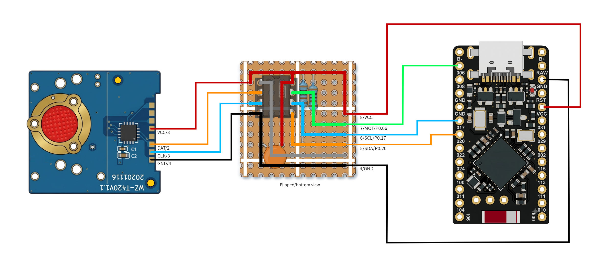

```
hello world;
```

In this article I'm going to showcase how i integrated a Chinese generic USB TrackPoint like this one:


With ZMK using a co-processor.

My current setup uses an ATtiny85, but i also used Arduino ProMini 8Mhz 3.3V and it was as good.

Using the ATtiny85 this is the wiring:


